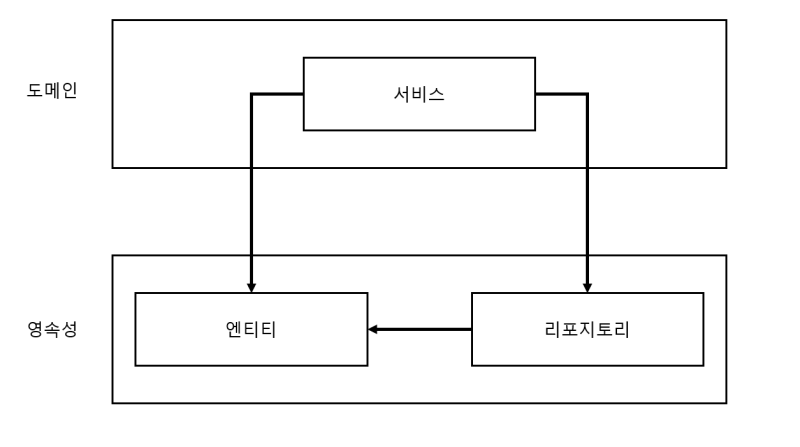

## 서문

--- 
### 학습목표
- 계층형 아키텍처를 사용했을 떄의 잠재적인 단점을 파악할 수 있다.
- 아키텍처 경계를 강제하는 방법을 적용할 수 있다.
- 잠재적인 지름길들이 소프트웨어 아키텍처에 어떻게 영향을 미칠 수 있는지 파악할 수 있다.
- 언제 어떤 스타일의 아키텍처를 사용할 것인지에 대해 논할 수 있다.
- 아키텍처에 따라 코드를 구성할 수 있다.
- 아키텍처에 각 요소들을 포함하는 다양한 종류의 테스트를 적용할 수 있다.
~~~text
지름길(short cut)
원문에서는 shortcut이라는 약간은 부정적인 늬앙스로 표현
하지만 이 책에선 잘 트레이드오프 하면 말그대로 지름길이 되지 않을까? 라는 생각으로 지름길로 표현 
~~~

## 1장 계층형 아키텍처의 문제는 무엇일까?
- 3계층으로 나뉘었을 때 보통 웹 -> 도메인 -> 영속성 계층으로 이루어진다.
- 견고한 패턴이고 요구사항과 외부요인에 빠르게 적응할 수 있게 해준다.
- 다만 나쁜 습관들이 스며들기 쉽고
- 시간이 지날수록 소프트웨어를 점점 변경하기 어렵게 만든다.
- 어떤 점 떄문에?
--- 
### 데이터베이스 주도 설계를 야기한다. 
- 웹 -> 도메인 -> 영속성 계층으로 의존하기 떄문에 자연스럽게 데이터베이스에 의존하게 된다.
- 그렇기 때문에 계층형 아키텍처는 영속성 계층을 토대로 만들어진다.
- `행동(behavior)`이 상태(state)를 바꾸는 주체이기 떄문에 상태보다는 행동을 중심으로 모델링한다.
- 이에 영속성 -> 도메인 -> 웹 순서로 구현하게 된다.
- 합리적인 방법이나 비즈니스 관점에서는`도메인 로직`을 먼저 만들어야 한다.
  - 로직을 제대로 이해했는지 알 수 있기 때문이다.
- 그리고 ORM과 계층형아키텍처가 결합하면 비즈니스규칙을 영속성 관점과 섞는 경우가 생긴다.

- ORM에 관리되는 엔티티들은 주로 `영속성 계층`에 두는데
- 도메인 계층에서는 위와 같은 엔티티들에 접근 가능하여 사용하게 되고
- 이는 `영속성 계층`과 `도메인 계층`간의 `강한 결합`이 생긴다.
- `서비스`는 `영속성 모델`을 `비즈니스 모델`처럼 사용하고 즉시로딩, 지연로딩, 트랙잭션, 캐시 플러시 등을 처리하게 됨
- 영속성 코드가 도메인 코드에 녹아들면서 둘 중 하나만 바꾸는 것이 어려워진다. 
### 지름길을 택하기 쉬워진다.

- 상위계층에서 하위계층으로 접근이 가능하다.
- 하위계층에서 상위계층으로 접근이 필요하다.
- 상위계층의 컴포넌트를 하위계층으로 내린다.
- 쉽게 해결한다.
- 선례가 생긴다.
- 다른 개발자가 어라? 하고 따라한다.
- 점점 비대해지며, 유지보수성이 떨어진다.  
-> 지름길 모드를 끄고 싶다면, 규칙이 깨졌을 때 빌드가 실패하도록 강제하는 규칙이 필요하다.
### 테스트하기 어려워진다.

- 상위에서 하위계층이 접근이 가능하다.
- 어? 웹에서 바로 영속성을 바라볼까 ?
  - 도메인 로직을 웹 계층에 구현하는 문제가 발생
    - 애플리케이션의 전반적인 책임이 섞이고 핵심 로직이 퍼짐
  - 웹 계층 테스트에서 도메인 계층뿐만 아니라 영속성 계층도 모킹해야 한다는 것
    - 테스트의 복잡도가 상승
    - Mocking 지옥에 빠질수도...
### 유스케이스를 숨긴다.

- 도메인 로직이 여러 계층에 흩어져 있어, 새로운 기능을 추가할 위치를 찾기 어렵다.
- 계층형 아키텍처는 `너비`에 관한 규칙을 강제하지 않는다.
- 여러개의 유스케이스를 담당하는 넓은 서비스가 만들어질 수 있다.
- 이상적인 것은 UserService 에서 `사용자등록` 유스케이스를 찾는 것보다
- `RegisterUserService`를 바로 열어 작업하는 것이다.
### 동시작업이 어려워진다.
~~~text
지연되는 소프트웨어 프로젝트에 인력을 더하는 것은 개발을 늦출 뿐이다.
- 맨머스 미신
오랜만에 봐서 적어봤다.
~~~
- 애플리케이션에 새로운 유스케이스를 추가한다고 가정해보자.
- 각각 웹, 도메인, 영속성을 개발할 수 있을까?
- 계층형은 그럴 수 없다. 영속성 -> 도메인 -> 웹을 해야하기 떄문
- 서로 다른 기능을 동시에 작업하기 힘듦 -> 같은 서비스를 동시에 편집할 때 머지 충돌을 야기하기 때문

### 유지보수 가능한 소프트웨어를 만드는데 어떻게 도움이 될까?
- 어떤 아키텍처를 선택하든 계층형 아키텍처의 함정을 염두하고, 지름길을 택하지 않으면 도움이 될 것이다.
---
## 2장 의존성 역전하기

--- 
### 단일 책임의 원칙

### 부수효과에 관한 이야기

### 의존성 역전 원칙

### 클린아키텍처

### 육각형 아키텍처(헥사고날 아키텍처)

- 그림참조: https://m.blog.naver.com/fbfbf1/222762182213

## 3장 코드구성하기

~~~bazaar
bukpal
├── domain
│   ├── Account
│   ├── Activity
│   ├── AccountRepository
│   └── AccountService
├── persistence
│   ├── AccountRepositoryImpl
└── web
    └── AccountController
~~~

~~~bazaar
bukpal
└── account
     ├── Account
     ├── AccountController
     ├── AccountRepository
     ├── AccountRepositoryImpl
     └── AccountService

~~~

~~~bazaar
buckpal
└── account
    ├── adapter
    |   ├── in
    |   |  └── web
    |   |      └── AccountController
    |   |        
    |   |       
    |   └── out
    |      └── persistence
    |          ├── AccountPersistenceAdapter
    |          └── SpringDataAccountRepository
    ├── domain
    |   ├── Account
    |   └── Activity
    |
    └── application
        ├── SendMoneyService
        └── port
            ├── in
            |   └── SendMoneyUseCase
            └── out
                ├── LoadAccountPort
                └──updateAccountStatePort

~~~

---
### 아래부터 wikibook이 제공하는 기본 Readme 이다.

---
# Example Implementation of a Hexagonal Architecture

This is the companion code to my eBook [Get Your Hands Dirty on Clean Architecture](https://leanpub.com/get-your-hands-dirty-on-clean-architecture).

It implements a domain-centric "Hexagonal" approach of a common web application with Java and Spring Boot. 

## Companion Articles

* [Hexagonal Architecture with Java and Spring](https://reflectoring.io/spring-hexagonal/)
* [Building a Multi-Module Spring Boot Application with Gradle](https://reflectoring.io/spring-boot-gradle-multi-module/)

## Prerequisites

* JDK 11
* this project uses Lombok, so enable annotation processing in your IDE
